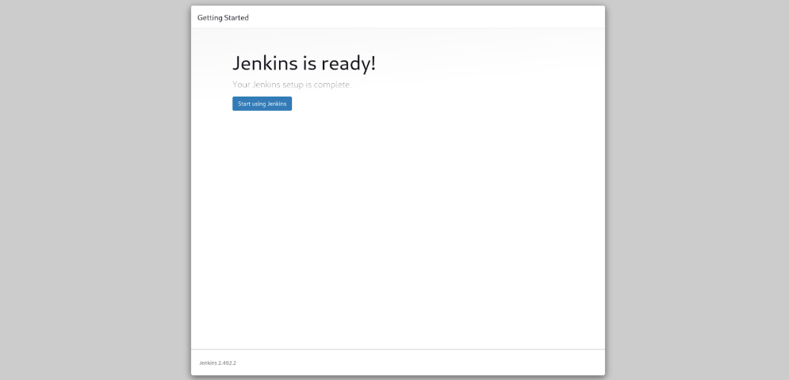

# 🚀 Installing Jenkins on Linux & Deploying Nginx via Jenkins

## 📌 Prerequisites

sudo apt update && sudo apt upgrade -y
```
---

## 🔹 Installing JDK 17

sudo apt install -y openjdk-17-jdk
```


Set Java 17 as the default version:
```bash
sudo update-alternatives --config java
```
When prompted, select the index corresponding to `java-17`.

---

## 🔹 Installing Jenkins
Jenkins isn't available in Ubuntu's default repositories. 
```bash
# Add Jenkins repository key
sudo wget -O /usr/share/keyrings/jenkins-keyring.asc \  
  https://pkg.jenkins.io/debian-stable/jenkins.io-2023.key

# Add the Jenkins repository to sources list
echo "deb [signed-by=/usr/share/keyrings/jenkins-keyring.asc]" \  
  https://pkg.jenkins.io/debian-stable binary/ | sudo tee \  
  /etc/apt/sources.list.d/jenkins.list > /dev/null

# Update package list and install Jenkins
sudo apt-get update
sudo apt-get install -y jenkins
```

---

## 🔹 Starting & Enabling Jenkins
To ensure Jenkins runs smoothly, start and enable it:
```bash
sudo systemctl enable jenkins
sudo systemctl start jenkins
sudo systemctl status jenkins
```

```
Copy the **initial admin password** displayed in this step.
```


---

## 🛠 Setting Up Jenkins
1. Open your browser and navigate to `http://localhost:8080`.
2. Paste the **admin password** you copied earlier.
3. Click **Continue**.
4. Select **Install Suggested Plugins**.
5. Once plugins are installed, click **Start Jenkins**.
6. Create a **username and password** for future logins.
   ⚠️ **Remember these credentials** – they replace the initial password.
7. Leave the default Jenkins URL and click **Save and Finish**.

---

## 🌍 Deploying an Nginx Project with Jenkins
Now that Jenkins is up and running, let’s create a **Freestyle Project** to install and configure **Nginx**.

### 📌 Steps to Set Up the Project
1. Go to **Jenkins Dashboard** → Click **Create a Job**.
2. Enter a **Project Name**.
3. Choose **Freestyle Project** and click **OK**.
 
 

1. Scroll to **Build Steps**.
 
1. Click **Add Build Step** → Select **Execute Shell**.
 

1. Paste the following script:

```bash
#!/bin/bash
# Update system package lists
sudo apt update -y

# Install Nginx
sudo apt install -y nginx

# Enable and start Nginx
sudo systemctl enable nginx.service
sudo systemctl start nginx

# Confirm Nginx is running
systemctl status nginx
```

7. Click **Save** and then **Build Now**.

---

## ✅ Verifying the Deployment
- Go to **Builds** → Click the latest **Build**.
- Navigate to **Console Output** to view logs.
- 
- To confirm Nginx is running, open your browser and go to `http://localhost`.

 We’ve successfully deployed Nginx using Jenkins!**
