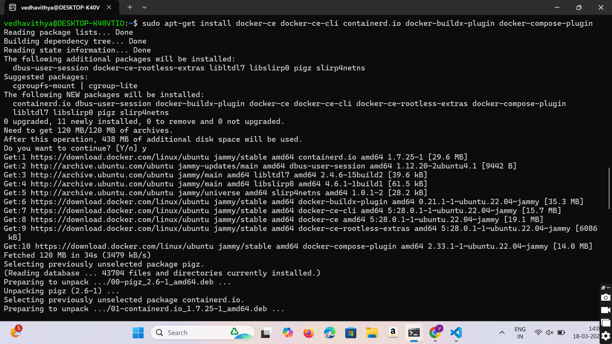

## Installing Docker 
Enter the following commands to install and verify installation of Docker
```bash
sudo apt update
sudo apt install -y docker.io
sudo systemctl enable docker --now
docker
```




## To verify the docker installation
```bash
docker --version
```


## Login to DockerHub and create a repository 

## Download Docker plugins in Jenkins
 - Go to Jenkins `Dashboard` -> `Manage Jenkins` -> `Available Plugins` -> Search `Docker`
 - Select these plugins and Install
    - Docker
    - Docker Commons
    - Docker Pipeline
    - docker-build-step
    - CoudBees Docker Build and Publish


## Add Jenkins to Docker group
 - Go to terminal and run these commands to add Jenkins to docker group
```bash
sudo usermod - aG docker jenkins
sudo systemctl restart jenkins
sudo reboot
```
- This will do its thing and reboot the system 

## Setting up docker credentials
 - Go to Jenkins > `Manage Jenkins` > `Credentials` > `System` > `Global Credentials (Unrestricted)` > `Add Credentials`
 -  Fill your Docker hub `username` , `password`, and in the `id` field enter `docker-seccred`


## Creating and building a pipeline

 - Go to Jenkins `Dashboard` > `Create a Job`


 - Enter a project name 
 - Select `pipeline`
 - Click `Ok`


 - Go to `pipeline`
 - Paste this script below and change the credential wherever mentioned:
```groovy

pipeline {
    agent any

    environment {
        IMAGE_NAME = "vedhavithya/devops"          // Replace with your Docker Hub username and image name
        TAG = "latest"
        CONTAINER_NAME = "my-container"
        PORT = "3001"
    }

    stages {
        
        stage('Clone Repository') {
            steps {
                echo "Cloning GitHub repository..."
                git branch:'main',url:'https://github.com/vedhavithyaseenivasan/New_docker_push.git'  // Replace with your repo URL
            }
        }

        stage('Build Docker Image') {
            steps {
                echo "Building Docker image..."
                sh 'chmod +x build.sh'
                sh './build.sh'
            }
        }

                stage('Login to Docker Hub') {
            steps {
                echo "Logging into Docker Hub..."
                withCredentials([usernamePassword(credentialsId: 'docker-hub-creds', usernameVariable: 'DOCKER_USER', passwordVariable: 'DOCKER_PASS')]) {
                    sh 'docker login -u $DOCKER_USER -p $DOCKER_PASS'
                }
            }
        }

        stage('Push Docker Image') {
            steps {
                echo "Pushing Docker image to Docker Hub..."
                sh "docker tag $IMAGE_NAME:$TAG $IMAGE_NAME:$TAG"
                sh "docker push $IMAGE_NAME:$TAG"
            }
        }

        stage('Deploy Docker Container') {
            steps {
                echo "Deploying Docker container..."
                sh 'chmod +x deploy.sh'
                sh './deploy.sh'
            }
        }
    }

    post {
        success {
            echo "Deployment Successful!"
        }
        failure {
            echo "Deployment Failed!"
        }
    }
}

```
 
 - click `save`
 - click `build`


 -Successfully Completed

 