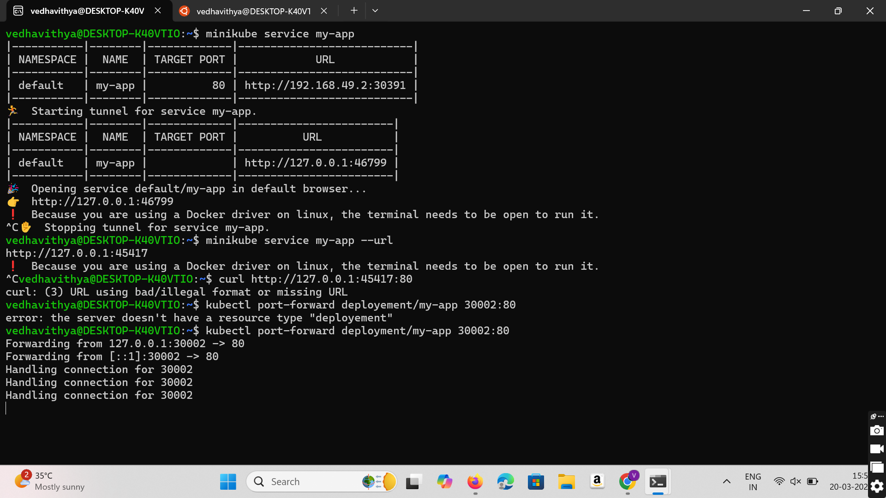

# Installing and Setting Up Kubernetes Minikube

## Update System Packages and Install Dependencies
```sh
sudo apt update && sudo apt upgrade -y
sudo apt install -y curl wget apt-transport-https conntrack socat
```


## Install Docker, Kubectl, and Minikube

### Install Docker
```sh
sudo apt install -y docker.io
sudo systemctl start docker
sudo systemctl enable docker
docker --version
```


### Install Kubectl
```sh
curl -LO "https://dl.k8s.io/release/$(curl -L -s https://dl.k8s.io/release/stable.txt)/bin/linux/amd64/kubectl"
chmod +x kubectl
sudo mv kubectl /usr/local/bin/
kubectl version --client
```


### Install Minikube
```sh
curl -LO https://storage.googleapis.com/minikube/releases/latest/minikube-linux-amd64
sudo install minikube-linux-amd64 /usr/local/bin/minikube
minikube version
```


## Fix Docker Setup
```sh
sudo usermod -aG docker $USER
reboot
```


## Verify Installation After Reboot
```sh
docker run hello-world
```

## Start and Open Minikube
```sh
minikube start --driver=docker
minikube dashboard
```

## Deploying the Docker Image from DockerHub
```sh
mkdir docker
nano Dockerfile
```

### Initialize NPM
```sh
npm init -y  # Run again if the previous command failed
```

### Pull and Build Docker Image
```sh
cd ..
docker pull vedhavithya/devops:latest  # Replace with your DockerHub repo
cd docker
docker build -t vedhavithya/devops/latest .
docker ps -a
```

## Deploy Application with Kubernetes

### Create Deployment
```sh
sudo nano nginx-deployment.yaml
kubectl apply -f nginx-deployment.yaml
```


### Create Service
```sh
sudo nano service.yaml
kubectl apply -f service.yaml
```

### Verify Deployment
```sh
kubectl get pods
minikube get svc my-app
```

### Access the Service
```sh
minikube service my-app --url
```

Open the provided URL in a browser or test it with:
```sh
curl <url>
```
