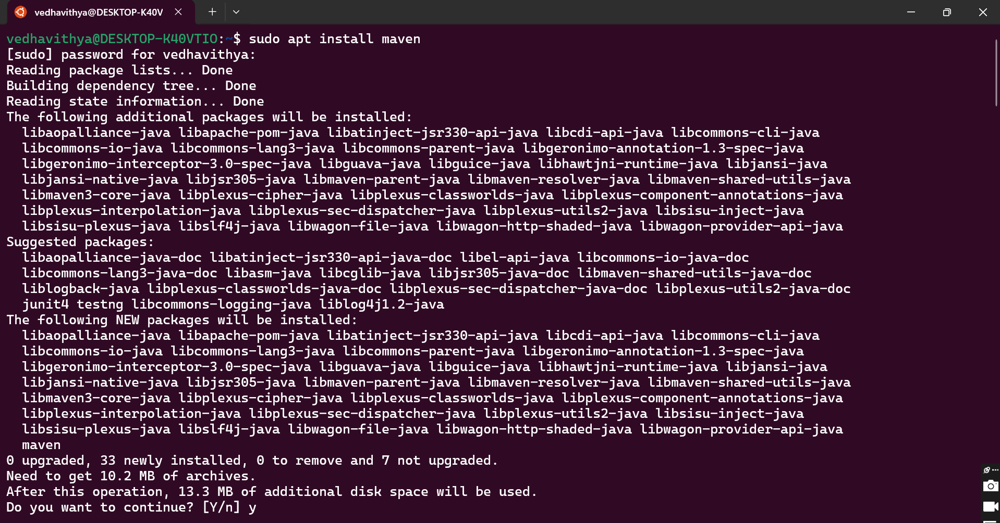
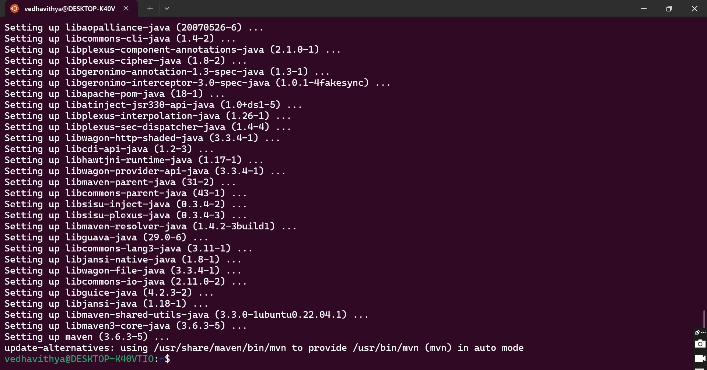
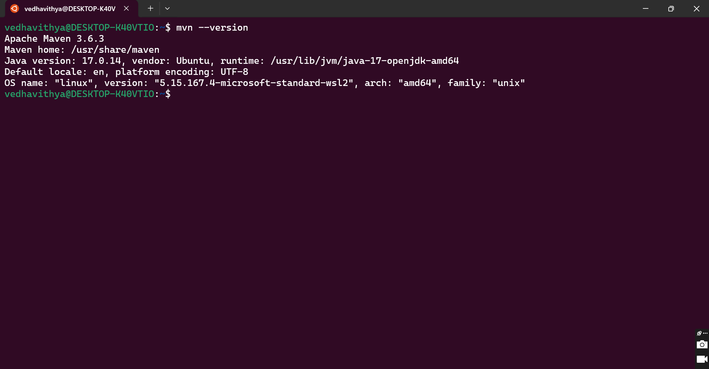
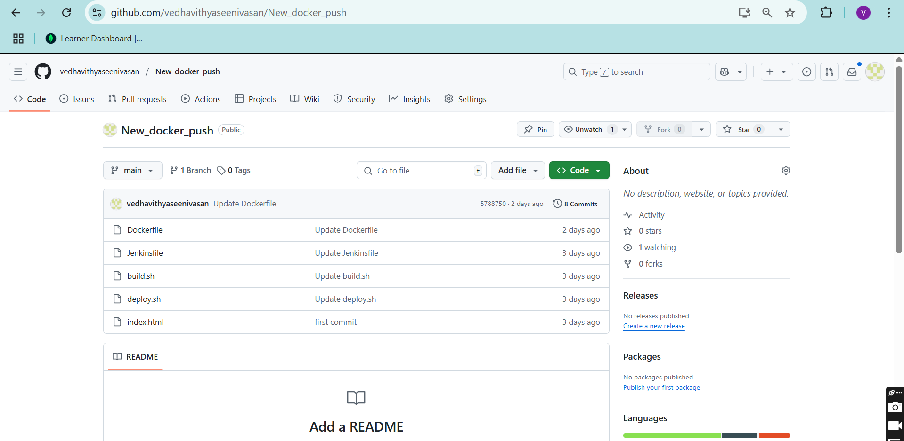
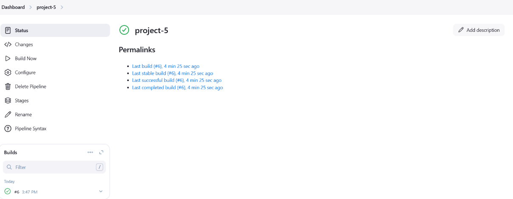

# Task 5: Install Maven and Configure Jenkins

## Install Maven

```bash
sudo apt install maven
```







---

## Fork the Repository on GitHub
Fork the required repository from GitHub.

    1.build.sh
    1.deploy.sh
---



## Configure Jenkins
1. Open **Jenkins** and navigate to:
   - **Manage Jenkins** > **Configure System** > **Tools**
2. Locate the **JDK** section.
3. **Uncheck** the "Install Automatically" option.
4. Set the name as **Java 17**.
5. Open the terminal and run the following command to find the Java 17 path:

   ```bash
   update-java-alternatives --list
   ```

6. Copy the Java 17 path and paste it in the **JAVA_HOME** field.


---

## Fork The Repo and Build the Pipeline
Fork the repository and set up a Jenkins pipeline to automate the build and deployment process.


